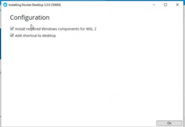

# Docker
Instalacion docker windows
 

- Nos dirigimos a google y buscamos "Install docker", la primera pagina que nos saldra es get docker, una vez entras te dejara seleccionar tu sistema operativo.
- Nos saldra una opccion que pone "Download from Docker Hub", al pulsar se descargar el archivo de instalacion.
- Abrimos la aplicaccion que se nos ha descargado, y en las opciones que nos salen tienen que estar las 2 marcadas.

- Le damos a OK.
- 
