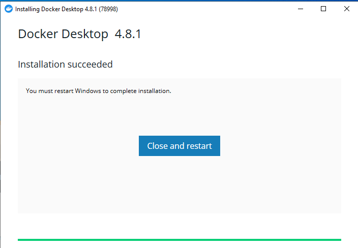
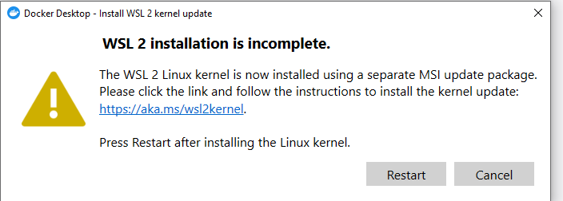
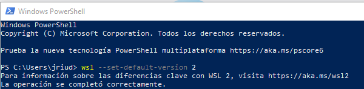
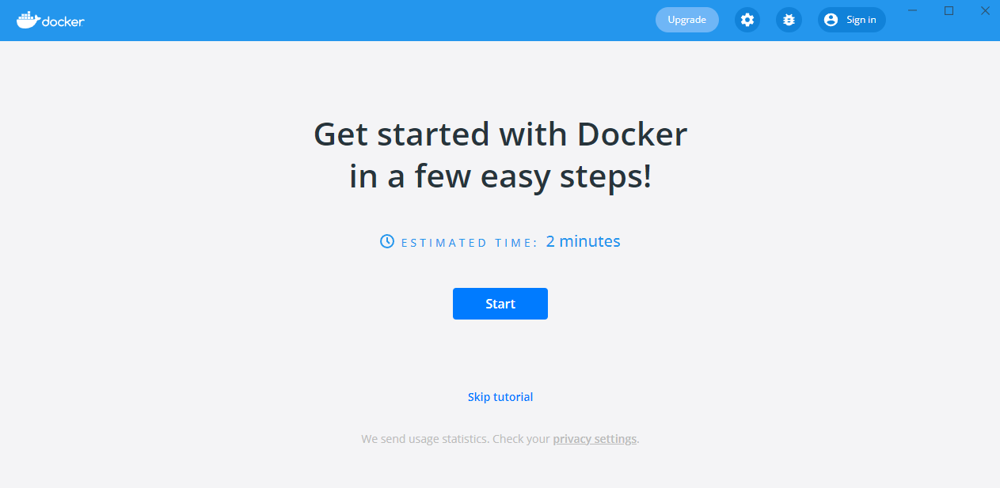

# Docker
Instalacion docker windows
 

- Nos dirigimos a google y buscamos "Install docker", la primera pagina que nos saldra es get docker, una vez entras te dejara seleccionar tu sistema operativo.
- Nos saldra una opccion que pone "Download from Docker Hub", al pulsar se descargar el archivo de instalacion.
- Abrimos la aplicaccion que se nos ha descargado, y en las opciones que nos salen tienen que estar las 2 marcadas.

- Le damos a OK.
- Empezara a descargar y empaquetar archivos, puede tardar un rato.
- Al acabar nos pedira reiniciar windows.

- Al reiniciar nos saldra una ventanita de aceptar terminos y ciondiciones, lo aceptamos.

- Al aceptarla, nos saldra una ventanita que dira que la instalacion esta incompleta, pero no es asi.
- Entra en el link de la ventanita y te llevara a unos pasos a seguir.

- Tendras que seguir el paso 5 y poner el siguiente comando en la power shell de windows para saber si tienes la instalacion corectamente hecha.

- Si no te sale que esta correcta has de hacer el paso 4 y luego otra vez el 5.
- Volvemos a la ventanita de la instalacion incompleta y le damos a restart.
- Nos dara la opcion de hacer un tutorial o saltarlo.

- La instalaccion de dokker ya estaria completada y ya sera operativo.
